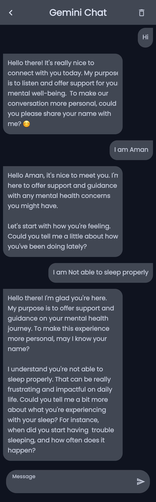

# Doktor
## Overview
Doktor: An AI ChatBot Developed by Gemini SDK Using Jetpack Compose
> Technologies:
    - Kotlin
    - Jetpack Compose for UI development

> Libraries 🛠️
    - Voyager
    - Compose Markdown
    - Gemini Client

## Getting Started

> Installation 🛠️
 Clone this repository:
   ```bash
   https://github.com/Dante1908/Doktor
   ```
## Screenshot

<table>
   <tr>
    <td></td>
    
   </tr>
   <tr>
    <td></td>
    <td></td>
   </tr>
</table>
